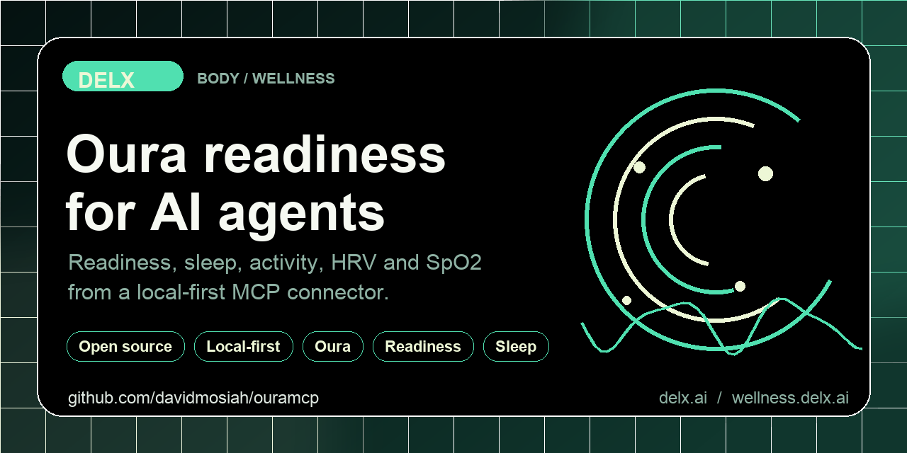

<!-- delx-wellness header v2 -->
<h1 align="center">Oura MCP</h1>

<div align="center">
  
</div>

<h3 align="center">
  Give your AI agent your Oura readiness, sleep, activity and HRV &mdash; without copy-pasting from the Oura app.<br>
  Local-first MCP server &mdash; <strong>tokens never leave your machine</strong>.
</h3>

<p align="center">
  <a href="https://www.npmjs.com/package/oura-mcp-unofficial"></a>
  <a href="https://www.npmjs.com/package/oura-mcp-unofficial"></a>
  <a href="LICENSE"></a>
  <a href="https://wellness.delx.ai/connectors/oura"></a>
</p>

<p align="center">
  <a href="https://github.com/davidmosiah/oura-mcp/stargazers"></a>
  <a href="https://modelcontextprotocol.io"></a>
  <a href="https://github.com/davidmosiah/delx-wellness-hermes"></a>
  <a href="https://github.com/davidmosiah/delx-wellness"></a>
</p>

> ⚡ **One-command install** with [Delx Wellness for Hermes](https://github.com/davidmosiah/delx-wellness-hermes):
> `npx -y delx-wellness-hermes setup` &mdash; preconfigures this connector and the other 8 in a dedicated Hermes profile.
>
> Or wire it standalone into Claude Desktop / Cursor / ChatGPT Desktop &mdash; see the install section below.

---

<!-- /delx-wellness header v2 -->

**Local-first MCP server that connects AI agents to your Oura Ring readiness, sleep, activity and HRV data.**

> **Unofficial project.** Not affiliated with, endorsed by or supported by Ōura Health Oy. Oura is a trademark of its respective owner. Use this only with your own Oura account and in line with the Oura Cloud API terms.

Built by [David Mosiah](https://github.com/davidmosiah) for people who use Claude, Cursor, Hermes, OpenClaw or other MCP-compatible agents to think about readiness, sleep and recovery — without copy-pasting numbers from the Oura app.

Part of [Delx Wellness](https://github.com/davidmosiah/delx-wellness), a registry of local-first wellness MCP connectors.

> If this connector helps your agent workflow, please star the repo. Stars make the project easier for other AI builders to discover and help Delx keep shipping local-first wellness infrastructure.

## Why this exists

Oura Ring produces some of the most refined personal health signals — readiness scores, sleep stages, HRV, daily activity, SpO2, body temperature trends. But it lives behind an OAuth API with per-scope authorization, and the data is split across multiple endpoints (daily readiness vs. detailed sleep periods vs. heart-rate streams).

This package handles the OAuth dance locally, normalizes responses across endpoints, and exposes Oura through the Model Context Protocol. Tokens never leave your machine. Privacy-mode defaults keep raw payloads opt-in.

## Setup in 60 seconds

You'll need an Oura app ([create one here](https://cloud.ouraring.com/oauth/applications)) with redirect URI `http://127.0.0.1:3000/callback`.

```bash
npx -y oura-mcp-unofficial setup    # interactive: paste client id + secret
npx -y oura-mcp-unofficial auth     # opens browser, captures the OAuth code
npx -y oura-mcp-unofficial doctor   # verifies you're ready
```

Recommended scopes:

```text
daily heartrate personal sleep workout spo2
```

Then add this to your MCP client config:

```json
{
  "mcpServers": {
    "oura": {
      "command": "npx",
      "args": ["-y", "oura-mcp-unofficial"]
    }
  }
}
```

For Claude Desktop, run `setup --client claude` and the snippet is written for you.

## Quickstart: see the data before you connect

No Oura account yet? Call `oura_demo` to get realistic example payloads for the
readiness, sleep and daily-summary tools, so your agent learns the data contract
before any OAuth setup. All values are synthetic and tagged `is_demo: true`.

```text
Call oura_demo and show me what the readiness and sleep data looks like.
```

Real output from `oura_demo` (`response_format=json`, dates are relative to today):

```jsonc
{
  "ok": true,
  "is_demo": true,
  "sample": {
    "oura_daily_summary": {
      "date": "2026-05-29",
      "readiness": { "score": 78, "temperature_deviation": -0.1, "hrv_balance": 84 },
      "sleep": { "score": 82, "efficiency": 89, "duration_min": 451, "deep_min": 92, "rem_min": 108 },
      "activity": { "score": 86, "steps": 9420, "active_calories": 412, "target_calories": 500 },
      "spo2": { "average": 96.8 }
    },
    "oura_wellness_context": {
      "window": "last_24h",
      "readiness_score": 78,
      "readiness_band": "good",
      "sleep_score": 82,
      "sleep_efficiency": 89,
      "hrv_balance": 84,
      "recommendation": "Solid readiness and efficient sleep — green light for moderate-to-high intensity. A protein-forward breakfast keeps HRV trending up."
    },
    "oura_list_daily_readiness": {
      "count": 3,
      "records": [
        { "day": "2026-05-29", "score": 78, "contributors": { "hrv_balance": 84, "resting_heart_rate": 71, "sleep_balance": 76 } },
        { "day": "2026-05-28", "score": 74, "contributors": { "hrv_balance": 79, "resting_heart_rate": 73, "sleep_balance": 72 } },
        { "day": "2026-05-27", "score": 69, "contributors": { "hrv_balance": 68, "resting_heart_rate": 80, "sleep_balance": 65 } }
      ]
    }
  },
  "notes": [
    "All sample data is synthetic; tagged with is_demo=true.",
    "Real calls return live data from the Oura Cloud v2 API after OAuth setup."
  ]
}
```

When you're ready to connect your own ring, call `oura_quickstart` for a
personalized 3-step setup walkthrough, then follow [Setup in 60 seconds](#setup-in-60-seconds).

## Try it with your agent

Three things to ask first:

```text
Use oura_connection_status to check setup, then run oura_daily_summary.
Give me a 5-line operating brief for today.
```

```text
Call oura_weekly_summary with response_format=json. Identify my biggest
readiness/sleep bottleneck and give me a next-week plan.
```

```text
Use the oura_daily_checkin prompt, focus=sleep.
Don't claim Oura can prove anything it can't.
```

## Data availability

This package uses the official Oura Cloud API v2. When this README says `raw`, it means the upstream Oura JSON for a supported endpoint — not raw device sensor streams.

| Data | Available | Notes |
|---|:---:|---|
| Daily readiness score + contributors | ✓ | Requires `daily` scope |
| Daily sleep score + sleep periods | ✓ | Requires `daily` and/or `sleep` scope |
| Sleep stages + timing | ✓ | When Oura returns scored sleep |
| Daily activity (steps, calories, MET) | ✓ | Requires `daily` scope |
| Heart-rate time series | ✓ | When ring/membership/scope expose it |
| HRV (overnight, via daily summaries) | ✓ | Surfaced through readiness contributors |
| SpO2 (daily averages during sleep) | ✓ | Requires `spo2` scope; supported devices |
| Workouts + sessions + tags | ✓ | Requires `workout`/`session`/`tag` scopes |
| Personal info (DOB, sex, height, weight) | ✓ | Requires `personal` scope |
| Continuous sensor telemetry | — | Not exposed by Oura Cloud API |

## Tools

**Start with these:**

- `oura_demo` — realistic synthetic readiness/sleep/activity payloads (no account needed; see [Quickstart](#quickstart-see-the-data-before-you-connect))
- `oura_quickstart` — personalized 3-step setup walkthrough that adapts to your current state
- `oura_connection_status` — verify local setup before calling Oura
- `oura_data_inventory` — inventory supported data domains, scopes, privacy modes and recommended first calls without calling Oura APIs.
- `oura_daily_summary` — readiness, sleep, activity and SpO2 brief for today
- `oura_weekly_summary` — scorecard, comparison vs prior week, next-week plan

**Auth & diagnostics**

- `oura_capabilities`, `oura_agent_manifest`, `oura_privacy_audit`, `oura_cache_status`
- `oura_get_auth_url`, `oura_exchange_code`, `oura_revoke_access`

**Profile**

- `oura_get_personal_info`

**Daily collections** (paginated, with after/before filters and privacy-mode override)

- `oura_list_daily_readiness`, `oura_list_daily_sleep`, `oura_list_daily_activity`, `oura_list_daily_spo2`

**Detailed collections**

- `oura_list_sleep`, `oura_list_workouts`, `oura_list_heartrate`, `oura_list_sessions`, `oura_list_tags`

## Prompts

- `oura_daily_checkin` — practical daily health and readiness check-in
- `oura_weekly_review` — review trends across activity, sleep and heart context
- `oura_heart_context_investigation` — investigate heart-rate records (privacy-aware)

## Resources

- `oura://capabilities`, `oura://agent-manifest`
- `oura://personal-info`
- `oura://latest/readiness`
- `oura://summary/daily`, `oura://summary/weekly`

## Privacy & security

- OAuth tokens are stored in `~/.oura-mcp/tokens.json` with `0600` permissions and are never returned by tools.
- The server never prints access or refresh tokens.
- `OURA_PRIVACY_MODE` defaults to `structured`. Raw Oura JSON is opt-in via `raw` mode or per-call override.
- Personal info (DOB, sex, height, weight) is only accessible when the user grants the `personal` scope.
- The MCP client never sees access or refresh tokens.
- This is **not medical advice**. The server exposes user-authorized data for personal AI workflows, not diagnosis or treatment.

## Configuration

`setup` writes most of these into `~/.oura-mcp/config.json` (`0600`). Manual env override is supported:

```bash
OURA_CLIENT_ID=…
OURA_CLIENT_SECRET=…
OURA_REDIRECT_URI=http://127.0.0.1:3000/callback

# Optional
OURA_SCOPES="daily heartrate personal sleep workout spo2"
OURA_PRIVACY_MODE=structured        # summary | structured | raw
OURA_CACHE=sqlite                   # optional read-through cache
OURA_TOKEN_PATH=~/.oura-mcp/tokens.json
OURA_CACHE_PATH=~/.oura-mcp/cache.sqlite
```

## Hermes / remote setup

```bash
npx -y oura-mcp-unofficial setup --client hermes --no-auth
npx -y oura-mcp-unofficial auth                      # run locally if browser auth is needed
npx -y oura-mcp-unofficial doctor --client hermes
hermes mcp test oura
```

After Hermes config changes, use `/reload-mcp` or `hermes mcp test oura`. Don't restart the gateway for normal data access.

If browser OAuth has to happen on a different machine than Hermes, run `auth` locally and copy `~/.oura-mcp/tokens.json` to the server with `chmod 600`.

## Requirements

- Node.js 20+
- An Oura app at <https://cloud.ouraring.com/oauth/applications> with redirect URI `http://127.0.0.1:3000/callback`

## Development

```bash
git clone https://github.com/davidmosiah/oura-mcp.git
cd oura-mcp
npm install
npm test
npm run build
```

Test with MCP Inspector:

```bash
npx @modelcontextprotocol/inspector node dist/index.js
```

## Links

- npm: <https://www.npmjs.com/package/oura-mcp-unofficial>
- Docs site: <https://wellness.delx.ai/connectors/oura>
- Legacy docs: <https://ouramcp.vercel.app/>
- GitHub: <https://github.com/davidmosiah/oura-mcp>
- Delx Wellness registry: <https://github.com/davidmosiah/delx-wellness>
- Connector quality standard: <https://github.com/davidmosiah/delx-wellness/blob/main/docs/connector-quality-standard.md>
- Oura Cloud API docs: <https://cloud.ouraring.com/docs/authentication>

<!-- delx-wellness see-also -->

## See also

The full [Delx Wellness](https://wellness.delx.ai) connector library:

| Provider | Package | Repo |
|---|---|---|
| WHOOP | [`whoop-mcp-unofficial`](https://www.npmjs.com/package/whoop-mcp-unofficial) | [whoop-mcp](https://github.com/davidmosiah/whoop-mcp) |
| Oura | [`oura-mcp-unofficial`](https://www.npmjs.com/package/oura-mcp-unofficial) | [oura-mcp](https://github.com/davidmosiah/oura-mcp) |
| Garmin | [`garmin-mcp-unofficial`](https://www.npmjs.com/package/garmin-mcp-unofficial) | [garminmcp](https://github.com/davidmosiah/garminmcp) |
| Strava | [`strava-mcp-unofficial`](https://www.npmjs.com/package/strava-mcp-unofficial) | [strava-mcp](https://github.com/davidmosiah/strava-mcp) |
| Fitbit | [`fitbit-mcp-unofficial`](https://www.npmjs.com/package/fitbit-mcp-unofficial) | [fitbitmcp](https://github.com/davidmosiah/fitbitmcp) |
| Withings | [`withings-mcp-unofficial`](https://www.npmjs.com/package/withings-mcp-unofficial) | [withingsmcp](https://github.com/davidmosiah/withingsmcp) |
| Apple Health | [`apple-health-mcp-unofficial`](https://www.npmjs.com/package/apple-health-mcp-unofficial) | [apple-health-mcp](https://github.com/davidmosiah/apple-health-mcp) |
| Polar | [`polar-mcp-unofficial`](https://www.npmjs.com/package/polar-mcp-unofficial) | [polarmcp](https://github.com/davidmosiah/polarmcp) |
| Nourish (nutrition) | [`wellness-nourish`](https://www.npmjs.com/package/wellness-nourish) | [wellness-nourish](https://github.com/davidmosiah/wellness-nourish) |

**One-command setup for Hermes** — preconfigures every connector above plus wellness skills + onboarding: [`delx-wellness-hermes`](https://github.com/davidmosiah/delx-wellness-hermes).

<!-- /delx-wellness see-also -->

## 📧 Contact & Support

- 📨 **support@delx.ai** — general questions, integration help, partnerships
- 🐛 **Bug reports / feature requests** — [GitHub Issues](https://github.com/davidmosiah/oura-mcp/issues)
- 🐦 **Updates** — [@delx369](https://x.com/delx369) on X
- 🌐 **Site** — [wellness.delx.ai](https://wellness.delx.ai)


## License

MIT — see [LICENSE](LICENSE).

## Disclaimer

This software is provided as-is. It is not a medical device, does not provide medical advice, and should not be used for diagnosis or treatment. Always consult qualified professionals for medical concerns.
